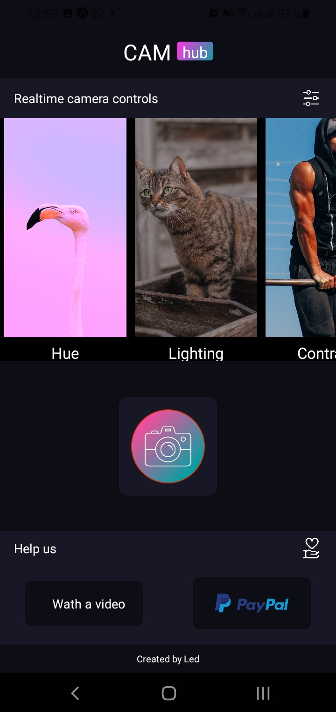

Camera App - React Native Expo

This React Native App use Expo to builda a camera application.

This is the main screen, wich contains video slider content.

Here it is the camera screen, it is able to take photos but require permission each time you take the pic, this is a trouble no fixed by expo.

The progress has been stopped but some problems with expo permissions to file system, so that this project continues with React Native CLI in the next repository.